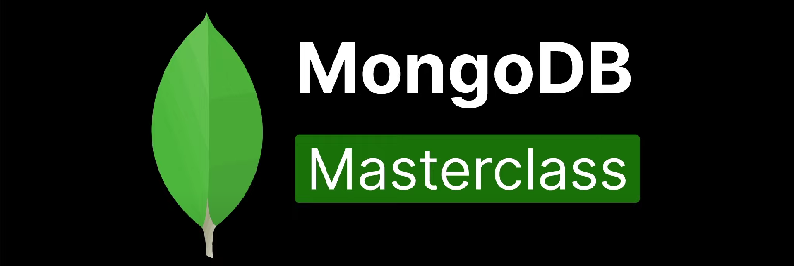

# 🍃 MongoDB Documentation — GrowthCodeLab Series



> A complete and structured MongoDB learning module curated by **[Ash-dot-coder](https://github.com/Ash-dot-coder)** under the `GrowthCodeLab` repository.  
> This repository is designed as a **progressive roadmap**, from beginner-level shell commands to advanced-level operations using MongoDB.

---

## 📖 What is MongoDB?

**MongoDB** is a popular open-source, NoSQL **document-oriented database**.  
It stores data in **BSON format** (Binary JSON) and allows flexible, scalable, and schema-less data storage. MongoDB is widely used in modern web development, especially with the **MERN stack**.

---

## 🗂️ Repository Structure

Each folder represents a specific concept/topic of MongoDB. These are arranged in a progressive learning order:

| Folder Name              | Topic Covered                        | Description |
|--------------------------|--------------------------------------|-------------|
| `01-CollectionInfo`      | Collection Basics                    | Learn how to show databases, get current DB, create collections, and list them. |
| `02-InsertData`          | Insert Operations                    | Covers insertOne, insertMany and how documents are added. |
| `03-Find`                | Basic Find Queries                   | Explore ways to retrieve documents using `find()` with filters. |
| `04-SortLimitSkip`       | Query Modifiers                      | Sort your results, limit output count, or skip certain documents. |
| `05-OperationsArray`     | Arrays in MongoDB                    | Learn how to query and manage array data in MongoDB. |
| `06-UpdatingDocument`    | Update Document                      | Perform updates using `updateOne`, `updateMany`, and `$set`. |
| `07-UpdateArray`         | Array Updates                        | Modify specific array elements using positional operators. |
| `08-LogicalOperators`    | Logical Operations                   | Use operators like `$in`, `$nin`, `$ne`, `$or`, `$and`. |
| `09-DeleteDocument`      | Deletion Operations                  | Learn to delete one or many documents with filters. |
| `10-QueryAssist`         | Query Helpers & Debugging            | Advanced querying and built-in `.help()` assist commands. |

---

## ✍️ Topic-wise Cheat Sheet & Definitions

### 🔹 `01-CollectionInfo`
- `show dbs` → Lists all non-empty databases.
- `db.getName()` → Displays the current active database.
- `db.collection.insertOne({})` → Creates a collection by inserting a document.
- `show collections` → Lists all collections in the active database.

---

### 🔹 `02-InsertData`
- `insertOne()` → Inserts a single document.
- `insertMany()` → Inserts multiple documents at once.
- MongoDB auto-generates `_id` for every document if not provided.

---

### 🔹 `03-Find`
- `find({})` → Fetches all documents.
- `find({ key: value })` → Fetches documents matching condition.
- `find({ key: { $gt: value } })` → Filters based on comparison.

---

### 🔹 `04-SortLimitSkip`
- `.sort({ key: 1/-1 })` → Ascending/descending order.
- `.limit(n)` → Restricts number of returned documents.
- `.skip(n)` → Skips the first `n` results.

---

### 🔹 `05-OperationsArray`
- `$in`, `$all`, `$elemMatch` → Work with arrays in documents.
- Example: `db.products.find({ tags: { $in: ["electronics"] } })`

---

### 🔹 `06-UpdatingDocument`
- `updateOne()` → Updates the first matching document.
- `updateMany()` → Updates all matching documents.
- `$set` → Modifies or adds a field.

```js
db.users.updateOne({ name: "Ayush" }, { $set: { age: 26 } })
```

---

### 🔹 `07-UpdateArray`

* Use `$push`, `$pop`, `$pull`, `$addToSet` for array modifications.
* Use positional `$` operator to target specific elements in arrays.

```js
db.users.updateOne({ name: "Ayush" }, { $push: { skills: "MongoDB" } })
```

---

### 🔹 `08-LogicalOperators`

* `$in`, `$nin` → Match values inside or outside a set.
* `$and`, `$or`, `$nor`, `$not` → Combine multiple conditions.

```js
db.users.find({ $and: [ { age: { $gt: 20 } }, { country: "India" } ] })
```

---

### 🔹 `09-DeleteDocument`

* `deleteOne()` → Deletes the first matching document.
* `deleteMany()` → Deletes all matching documents.
* `.help()` → View method documentation inside Mongo Shell.

---

### 🔹 `10-QueryAssist`

* Use `.help()` to get method-specific documentation.
* `console.table(results)` → Beautifies result sets in tabular format.

```js
const results = db.collection.find().toArray()
console.table(results)
```

---

## 📦 Extra Files

| File Name                 | Purpose                           |
| ------------------------- | --------------------------------- |
| `DataCollection-JSONFile` | Sample datasets in JSON format    |
| `MongoDB.png`             | Visual diagram or reference image |

---

## 📘 Learning Tips

* ✅ Practice daily on MongoDB Shell or MongoDB Atlas.
* ✅ Use `.help()` frequently to explore features.
* ✅ Think in terms of **JSON** — MongoDB is built around it.
* ✅ Focus on CRUD: **Create, Read, Update, Delete**.

---

## 🚀 Part of GrowthCodeLab Series

Explore more hands-on repositories:

* [JavaScript](https://github.com/Ash-dot-coder/GrowthCodeLab/tree/code/JavaScript%20-%20JS)
* [React](https://github.com/Ash-dot-coder/GrowthCodeLab/tree/code/React%20-%20JS)
* [Node-JS](https://github.com/Ash-dot-coder/GrowthCodeLab/tree/code/NODE-JS)
* [Express-JS](https://github.com/Ash-dot-coder/GrowthCodeLab/tree/code/Express-JS)
* [DATA-BASE](https://github.com/Ash-dot-coder/GrowthCodeLab/tree/code/DATA-BASE)

---

## 👨🏻‍💻 Author

**Ayush Kohre**
- 🌐 [GitHub: Ash-dot-coder](https://github.com/Ash-dot-coder)
- 🧑‍🏫 Front-End | MERN Stack Developer
- 🎓 Documented under: GrowthCodeLab MongoDB Series

---

> Crafted with ☕, 💻 & ❤️ to help developers master MongoDB — one folder at a time.

---