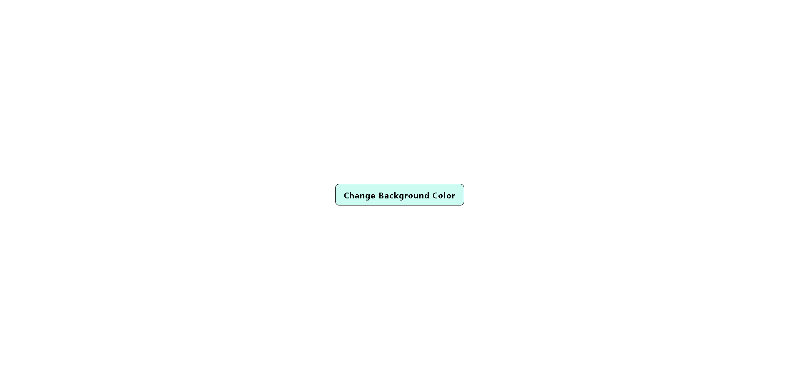
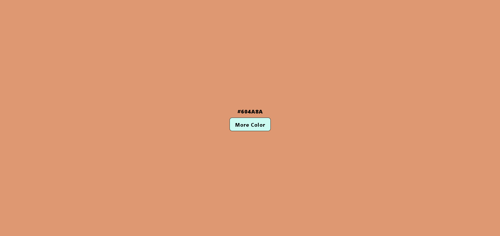

# 🎨 Change Background Color

A simple yet interactive project that allows users to change the background color of a webpage dynamically using JavaScript.

## 🌟 Live Demo

🔗 [View Project](https://ash-dot-coder.github.io/GrowthCodeLab/JavaScript%20-%20JS/DOM/Beginner%20Level/Change%20Background%20Color/index.html)

## 📂 Repository

🔗 [GitHub Repository](https://github.com/Ash-dot-coder/GrowthCodeLab/tree/code/JavaScript%20-%20JS/DOM/Beginner%20Level/Change%20Background%20Color)

## 🛠️ Tech Stack

- **HTML** – Structure of the webpage
- **Tailwind CSS** – Styling and layout
- **JavaScript** – DOM manipulation for color change

## 🚀 Features

✅ Click a button to change the background color  
✅ Random color generation on each click  
✅ Clean and minimal UI with Tailwind CSS

## 📸 Screenshot




## 🔧 How to Run Locally

1. Clone the repository
   ```bash
   git clone https://github.com/Ash-dot-coder/GrowthCodeLab.git
   ```
