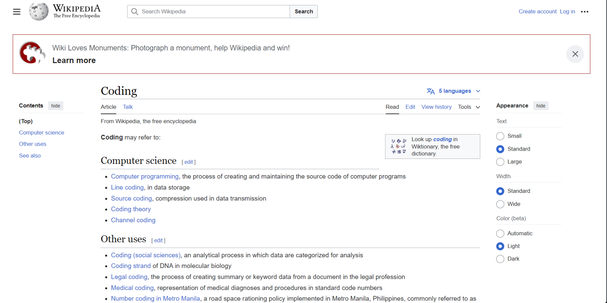

# React + Vite

This template provides a minimal setup to get React working in Vite with HMR and some ESLint rules.

Currently, two official plugins are available:

- [@vitejs/plugin-react](https://github.com/vitejs/vite-plugin-react/blob/main/packages/plugin-react/README.md) uses [Babel](https://babeljs.io/) for Fast Refresh
- [@vitejs/plugin-react-swc](https://github.com/vitejs/vite-plugin-react-swc) uses [SWC](https://swc.rs/) for Fast Refresh

### Assignment Instructions:

1. **Break Down the UI into Components**  
   Take a look at the provided UI. Your task is to divide it into multiple React components. You don't need to write any code for this step. Simply use a pen and paper or a photo editing tool to visualize how the UI can be split into different components. This exercise will help you get a better understanding of component structure in React.

1. **Create a Greet Component**
   - Create a new file called `Greet.jsx` and inside that file, write a `Greet` component using the **function declaration** syntax.
   - Afterward, refactor the `Greet` component to use the **arrow function** syntax.
   - Finally, register the `Greet` component in your `App.jsx` file so that you can see the result when running the app.